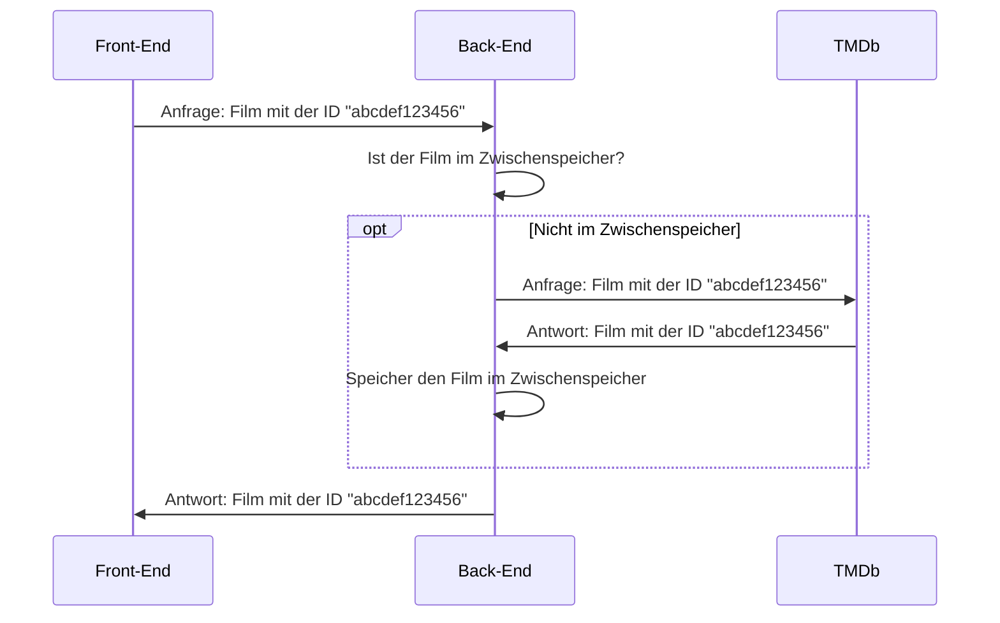
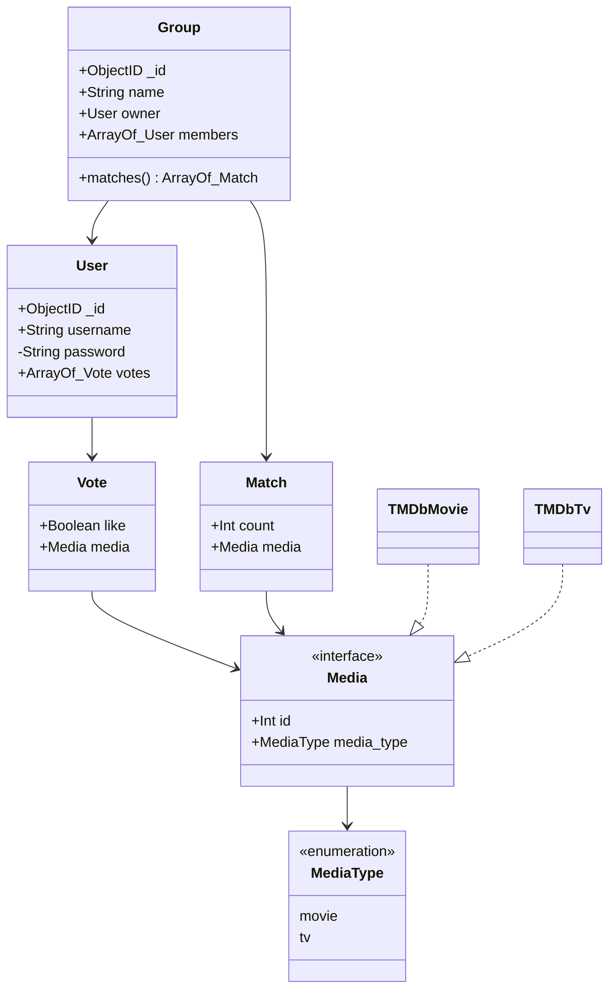

**Hinweis:** "Filme und Serien" wird in diesem Dokument als "Filme" abgekürzt.

# Projektbeschreibung

## Projektumfeld

Das Projekt wurde von mir im Rahmen der betrieblichen Projektarbeit in meinem Ausbildungsbetrieb der inSynergie GmbH durchgeführt. Die inSynergie GmbH, gegründet im Jahr 2000, ist ein inhabergeführtes, mittelständisches Unternehmen mit zur Zeit 45 fest angestellten Mitarbeitern. Im Rahmen der Projektarbeit planen und realisieren wir ganzheitliche Lösungen in den Bereichen Medientechnik und Exponatebau. Ein zweiter Schwerpunkt ist die Entwicklung und der Vertrieb von multimedialen Steuerungsprodukten und Ihrer Software. Unser Produktportfolio beinhaltet Eigenentwicklungen aus den Bereichen: Steuerungs- und Touchpanels, Audiosysteme, Videosysteme und Steuerungssysteme.

## Projektziel

Ein Endbenutzer kann die Anwendung in einem Webbrowser seiner Wahl aufrufen. Beim ersten Aufruf der Anwendung wird der Endbenutzer durch eine Login-Seite darauf hingewiesen einen Account zu erstellen. Nachdem er sich angemeldet hat, wird er auf die Hauptseite umgeleitet.

Dort findet er ein Kartendeck, welches aus momentan populären Filmen besteht. Diese Karten kann er mit seiner Maus oder über Touch-Input bewegen. Unter den Karten liegen außerdem zwei Button-Inputs. Der linke Button ist ein rotes Kreuz und der rechte Button ein grünes Herz. Hier wird durch die Design-Entscheidung der Farben und Symbole darauf hingewiesen, dass man die Filme mit eben diesen Buttons negativ (Rotes Kreuz) oder positiv (Grünes Herz) bewerten kann. Zusätzlich kann man die Bewertung auch ausführen, indem man die Karte in die jeweilige Richtung schleudert (links: negativ; rechts: positiv). Nach 10 bewerteten Karten ist das Deck leer. Das Ergebnis wird dann aus dem (+FrontEnd) ((+React)) an das (+BackEnd) ((+NodeJS)) weitergeleitet und in einer (+MongoDB) hinterlegt. Basierend auf diesen Bewertungen werden dann die nächsten Filme gewählt, die das Kartendeck darstellen soll.

Über eine Navigationsleiste gelangt der Endbenutzer zur Gruppenübersichts-Seite. Auf dieser findet er alle Gruppen, denen er beigetreten ist und hat die Möglichkeit neue Gruppen zu erstellen. Wenn er auf eine Gruppe klick, wird er zu der Detail-Seite dieser umgeleitet. Hier findet er eine Liste der von ihm und anderen Gruppenmitgliedern positiv bewerteten Filmen. Je mehr positive Bewertungen ein Film erhält, desto mehr Sterne erhält dieser und desto höher wird er in der Liste angezeigt. Mit 5 Sternen erreicht ein Film die höchste Bewertung, welche durch eine Farbänderung der Herzen gekennzeichnet wird.

## Projektbegründung

Der Zweck dieser Anwendung ist es, ein realistisches Projekt-Ziel zu haben, in den man neue Technologien testen und bereits eingesetzte Technologien festigen und überdenken kann. Diese erlangten Kenntnisse kommen dann möglicherweise auch in einer Vielzahl an zukünftigen Projekten zum Einsatz. Deshalb dient dieses Projekt, als auch diese Dokumentation als eine Art Pilotprojekt.

## Projektschnittstellen

Der Endbenutzer kann die Webanwendung in jedem aktuellen Browser und auf einer Vielzahl von Geräten wie PCs, Notebooks über Tablets bis hin zu Smartphone aufrufen.

Das (+FrontEnd) der Webanwendung läuft auf einem (+NginX)-Server und das (+BackEnd) auf einem (+NodeJS)-Server mit (+Express) und (+MongoDB).

Genehmigt wurde das Projekt von der Leitung der Entwicklungsabteilung. Dieser wurde auch der aktuelle Stand zweimal wöchentlich präsentiert, sowie über eine zu jeden Tag aktualisierte Test-Installation zugänglich gemacht.

## Projektabgrenzungen

Basiskenntnisse in der Erstellung von einfachen Webanwendung wie das Erstellen von HTML-Seiten, der Implementierung von CSS-Stilen, sowie der Einbindung von JavaScript Dateien werden vorausgesetzt, da eine genauere Beschreibung dieser Vorgänge den Rahmen dieser Dokumentation sprengen würde.

# Projektplanung

## Projektphasen

Das Projekt wurde innerhalb von 70 Stunden durchgeführt.

<!-- TODO Zeitplanungs Diagram? -->

## Abweichungen vom Projektantrag

Aspekte der Implementierung wurden aus zeitlichen Gründen ausgelassen. Dabei wurde darauf geachtet, dass keine Core-Konzepte entfallen. Zu den nicht implementierten Seiten zählen die "Film-Details", "Benutzerprofil", sowie die "Neuer Benutzer" Seite. Die letztere Seite wurde ausgelassen, da ein ähnliches Feature bereits in der "Swiping-Game" Seite durch das Empfehlen von populärer Filmen existierte.

## Entwicklungsprozess

Als Entwicklungsprozess wurde die agile Softwareentwicklung verwendet, sodass während der Implementierung ständige Rücksprache mit der Entwicklungsabteilung bestand.

# Implementierung

## Front-End

### Initialisierung

Das Projekt wurde mit Hilfe von (+CreateReactApp) über den Befehl `yarn create react-app swiped-frontend --template typescript` initialisiert. Dies erstellt eine Basisumgebung für eine neue (+React) Einzelseitenanwendung mit (+TypeScript) als Programmiersprache, (+Webpack) als Bundler und out-of-the-box Support für viele Entwickler-Features wie zum Beispiel dem (+HotReloading). Die erstellte Ordnerstruktur ist zunächst etwas "Unordentlich", weshalb sie zu einer sinnvolleren Ordnerstruktur umgeändert wurde (Siehe Anhang [A.1](#front-end-ordnerstruktur)). Als Nächstes wurden Konfigurationen für weitere Entwickler-Tools wie zum Beispiel (+ESLint) und (+Prettier) angelegt. Diese helfen dabei den Quellcode einheitlich zu halten und nehmen einiges an Arbeit ab.

### Front-End Framework

Als (+FrontEnd) Framework wurde (+React) gewählt. (+React) wurde mit dem Fokus erstellt, für Webanwendungen zu erstellen. Eine (+React)-Komponente ist ein View, der von der Anwendung abgekapselt ist. Damit lassen sich zum Beispiel Buttons, Text-Elemente oder Beschriftungen isoliert und wiederverwendbar entwickeln. Zudem ist die spürbare Geschwindigkeit der Anwendung hoch, da (+React) nur DOM-Manipulationen an Komponenten ausführt dessen sichtbare Daten sich ändern.

(+React) ist (+OpenSource) und wird von Facebook und einer Community einzelner Entwickler und Unternehmen gepflegt. Dadurch existiert für die Bibliothek eine sehr solide Dokumentation. Aber auch für obskurere Probleme findet man durch eine immer größer werdende Community an Entwicklern Lösungen. Da (+React) unter der (+MITLizenz) steht, kann es kostenlos verwendet werden.

### Styling

Ich habe mich schon früh dazu entschieden die (+React)-Komponenten Bibliothek "(+MaterialUI)" mit in das Projekt einzubinden. (+MaterialUI), welches Google's Design-Sprache (+MaterialDesign) als (+React)-Komponenten implementiert, erlaubt es mit einer einheitlichen Kollektion von Basis-Komponenten zu starten. Auch das Überschreiben der Standardwerte ist durch ein Theming-Konzept sehr leicht (Siehe Anhang [A.2](#material-ui-theming-konzept)). Styling wird bei der Verwendung von (+MaterialUI) nicht in CSS, sondern dank (+JSS) in JavaScript geschrieben. Dies ermöglicht es CSS dynamisch aus dem Quellcode zu manipulieren (Siehe Anhang [A.3](#styling-mit-material-ui)).

### Animationen

Für die Animationen der Karten wurde sich entschieden (+ReactSpring) im Zusammenspiel mit (+ReactUseGesture) zu verwenden. Dies stellt, wie auch (+MaterialUI), einen Quellcode nahen Ansatz für CSS Manipulationen dar (Siehe Anhang [A.4](#react-spring--react-use-gesture-animations-beispiel)).

### Formulare

Die Formulare der Login-, Registrier-, sowie der Gruppen-Editier Seiten benutzen ein Tool names "(+ReactHookForm)". Mit diesem Tool kann man leicht Formulare implementieren, ohne das man auf Daten-Felder, Validatoren und andere Sachen, um die man sich normalerweise selber kümmern müsste, achten muss. Hierzu verwendet man einfach Wrapper-Komponenten, die sich dann Intern selbstständig einen State zusammenstellen (Siehe Anhang [A.5](#react-hook-form-formular-beispiel)).

### Back-End Kommunikation

Das (+FrontEnd) kommuniziert mit dem (+BackEnd) über eine (+GraphQL)-Schnittstelle. Genauer gesagt wird auf beiden Seiten der Anwendung eine (+Apollo)-Plattform eingerichtet und verwendet. Das benutzen von (+Apollo) hat mehrere Vorteile, wie z.B.: 100% Kompatibilität, da im (+BackEnd) der (+Apollo)-Server und im (+FrontEnd) der (+Apollo)-Client verwendet wird, und einfaches Einrichten mit vielen Konfigurationsmöglichkeiten.

## Back-End

### Initialisierung

Es wurde sich dafür entschieden, auch im (+BackEnd) (+Webpack) einzusetzen. Auf diese Weise wird der (+TypeScript) Quellcode nach dem Transcompilen (Siehe (+Transpiler)) in eine durch (+NodeJS) ausführbare Bundle-Datei gepackt. Wie im (+FrontEnd) wurden auch hier weitere Konfigurationen (z.B.: (+ESLint) und (+Prettier)) angelegt und auf das Projekt angepasst.

### Datenquelle

Für die Filminformationen wird eine öffentlich zugängliche API-Schnittstelle namens The Movie Database ((+TMDb)) verwendet. Statt die Anfragen direkt aus dem (+FrontEnd) an diese API zu senden, wird hier allerdings das (+BackEnd) als (+Proxy) verwendet. Das (+FrontEnd) sendet also Anfragen an das (+BackEnd), welches dann die benötigten (+TMDb) API-Anfragen macht. Die darauffolgenden Antworten werden dann an das (+FrontEnd) weiter geleitet. Dies verhindert, dass der geheime API-Schlüssel bekannt gemacht wird. Zusätzlich hat man so auch die Option, die empfangenden Daten zu manipulieren oder sonstig zu verarbeiten. Im Falle dieses Projektes ist es zum Beispiel wichtig, dass die (+TMDb) API-Anfragen zwischengespeichert werden, da sonst sehr schnell die tägliche Quota aufgebraucht wird (Siehe Anhang [A.6](#ablauf-von-film-api-anfragen)).

### Datenbank

Als Datenbank wird (+MongoDB) im Zusammenspiel mit (+Mongoose) als Datenbankadapter verwendet. Die Datenbank-Schemas sind zusammen mit den API-Definitionen unter `src\schema` zu finden. Dort werden auch die Relationen definiert. (Siehe Anhang [A.7](#uml-diagram) und [A.8](#erstellen-eines-schemas))

### Authentifizierung

Die Endbenutzer Authentifizierung wurde mit (+Bcrypt) und JSON-Web-Token ((+JWT)) realisiert. Das heißt, dass die Passwörter der Endbenutzer Dank (+Bcrypt)-Verschlüsselung nicht im Klartext in der Datenbank gespeichert werden. Durch (+JWT) werden dem Endbenutzer (bzw. dem (+FrontEnd)) Tokens bereitgestellt, mit denen man sich gegenüber der (+GraphQL)-Schnittstelle Authentifizieren kann. Diese Tokens werden mit einem geheimen Schlüssel verschlüsselt. (Siehe auch (+Salt) und Anhang [A.9](#bcrypt-und-json-web-token))

## Sonstiges

### Codegenerierung

In diesem Projekt wird ein Tool names "(+GraphQLCodegen)" eingesetzt. Dieses generiert anhand des (+GraphQL)-Schemas automatisiert Quellcode. Im (+BackEnd) und im (+FrontEnd) wird so die Datei `src\types\api.generated.ts` angelegt, welche das komplette API-Schema als (+TypeScript) Typisierungen enthält. Zusätzlich werden im (+FrontEnd) auch `.graphql` Dateien, welche (+GraphQL) Operationen enthalten, als (+^ReactHook) umgewandelt. (Siehe Anhang [A.10](#automatisierte-codegenerierung-durch-graphql-codegen))

### Deployment

Das Projekt wurde mithilfe von (+Docker) und (+DockerCompose) auf meinen von mir gemieteten OVH-Server deployed. Die (+Docker)-Umgebung hat den Vorteil, dass ein Deployment immer plattformunabhängig nachstellbar ist. Die Datei, die beschreibt wie ein (+Docker)-Container erstellt werden soll, nennt sich `Dockerfile` und ist im Stammverzeichnis beider Projekte zu finden.

Zusätzlich sind die (+Docker)-Images auch im (+Docker)-HUB unter `she11sh0cked/swiped-frontend` und `she11sh0cked/swiped-backend` auffindbar. Dies erleichtert den Deployment-Prozess, da bei jeden (+Git)-Push automatisiert eine neue Version der Images gebaut wird.

# Qualitätskontrolle

## Statische Quellcode-Analyse

Zur statischen Quellcode-Analyse wurde ein auf das Projekt zugeschnittenes (+ESLint)-Regelwerk angelegt. Dieses enthält spezielle Regeln für (+React) und (+^ReactHook), (+TypeScript), Sortierreihenfolgen und vieles mehr. Dies ist sehr hilfreich, da es einfache Fehler im Quellcode durch Warnungen verhindert.

Die Regelwerke kann man sich aus dem Stammverzeichnis der Projekte unter der Datei `.eslintrc.js` entnehmen.

## Quellcode formatierung

Damit der Quellcode einheitlich bleibt wurde das Code-Formatier Tool "(+Prettier)" eingesetzt. Auch hier wurde eine Konfigurations-Datei angelegt, die allerdings größtenteils die Standardwerte des Tools übernimmt. Die einzig angepassten Regeln sind das ausschalten von Semikolons und das Anpassen des Anführungszeichen-Charakters auf ein einfaches Anführungszeichen.

Auch diese Konfigurationen lassen sich im Stammverzeichnis der Projekte unter der Datei `.preettierrc.js` einsehen.

## Manuelle Tests

Die manuellen Tests im Bereich (+React) wurden unter anderen mit der Chrome-Erweiterung "React Developer Tools" durchgeführt, welche den Wert aller in der aktuellen Ansicht vorhandenen Variablen darstellt und manipulieren lässt.

Die (+GraphQL)-API wurde mithilfe der in der (+Apollo) integrierten Schnittstelle "GraphQL-Playground" getestet. Diese ermöglicht das Einblicken des kompletten Schemas und das interactive Erstellen und Senden von Anfragen.

Die Webapplikation wurde auch in verschiedenen Browsern und auf verschiedenen Geräten getestet.

## Versionierung

Von Beginn des Projektes an wurde (+Git) als Versionsverwaltung verwendet. Der Übersichtlichkeit wegen wurde jedem Commit, nach dem (+Gitmoji) Prinzip ein Emoji zugewiesen, der die Art der Änderung beschreibt. Ein Beispiel wäre "\emoji{bug}" für das Korrigieren von Fehlern (Bugs) oder "\emoji{sparkles}" für das Implementieren von neuen Features.

# Wirtschaftlichkeitsbetrachtung

## Projektkosten

Jegliche verwendete Software ist zur freien Verwendung oder Open Source verfügbar (z.B.: (+React) und (+NodeJS)). Ebenso wurde die verwendete Hardware schon vor dem Projekt bezahlt. Auf dem Webserver werden auch andere Webseiten gehostet, sodass diesbezüglich auch keine weiteren Kosten angefallen sind. Somit fielen nur mein Stundenlohn als Kosten an. Für diesen Punkt wurde von einem pauschalen Stundensatz von 10€ ausgegangen. Somit ergeben sich folgende
Projektkosten: Durchführungszeit von 70 Stunden x 10€ Kosten pro Stunde, also Projektkosten von gesamt 700,00€.

\clearpage
\printnoidxglossary[sort=word]
\clearpage

\appendix

# Anhang

**Hinweis:** Die hier zu findenden Code-Beispiele wurden gekürzt, damit die angesprochenen Punkte klarer erklärt werden. Funktionsfähige Versionen dieser Dateien kann man in jeden Beispiel unter `// file: path/to/file` finden.

## Front-End Ordnerstruktur

**Initiale Create-React-App Ordnerstruktur:**

\dirtree{%
.1 swiped-frontend/.
.2 public/\DTcomment{Alle statischen Dateien (z.B.: index.html, favicon.ico)}.
.2 src/\DTcomment{Alle Quellcode Dateien (z.B.: index.js)}.
}

**Meine Ordnerstruktur:**

\dirtree{%
.1 swiped-frontend/.
.2 public/\DTcomment{Alle statischen Dateien (z.B.: index.html, favicon.ico)}.
.2 src/.
.3 api/\DTcomment{Quellcode der mit dem Verbindungs-Code des \gls{BackEnd} zu tun hat (z.B.: \gls{Apollo}-Client initialisierung)}.
.3 app/\DTcomment{Einstiegspunkt des \gls{React}-Teils der Anwendung}.
.3 components/\DTcomment{Globale \gls{React}-Komponenten, die sich in jeden Container verwenden lassen (z.B.: Button Komponente)}.
.3 containers/\DTcomment{Hauptseiten die sich aus globalen und Container spezifischen Komponenten zusammensetzen (z.B.: Login Container)}.
.3 store/\DTcomment{\gls{MobX} Stores für Daten die Global in der Anwendung erreichbar sein sollen (z.B.: Name der aktuellen Seite)}.
.3 types/\DTcomment{Globale typisierungs-Dateien (z.B.: API Typisierungen)}.
.3 utils/\DTcomment{Nützliche und wiederverwendbare Code-Snippets (z.B.: uppercaseFirstLetter.ts)}.
}

\clearpage

## Material-UI Theming-Konzept

```ts
// file: src\app\theme.ts

import { createMuiTheme } from "@material-ui/core/styles";

export default createMuiTheme({
  overrides: {
    MuiButton: {
      root: {
        height: "min-content",
      },
    },
    MuiCssBaseline: {
      "@global": {
        "#root": {
          display: "grid",
          gridTemplateRows: "max-content auto",
          height: "100%",
          overflow: "hidden",
          position: "fixed",
          width: "100%",
        },
      },
    },
  },
});
```

Hier werden allen (+MaterialUI) Buttons die CSS-Property `height: "min-content"` hinzugefügt. Zusätzlich wird hier auch die DIV mit der ID "root" gestyled.

\clearpage

## Styling mit Material-UI

```tsx
// file: src\containers\group\components\list\List.tsx

import { withStyles } from "@material-ui/core";

import styledBy from "utils/styledBy";

const StyledRating = withStyles({
  iconFilled: {
    color: styledBy("color", {
      default: undefined,
      red: red[400],
    }),
  },
})(Rating);

function MyList({ matches, membersCount }) {
  return (
    <List>
      {matches.map((match) => {
        const rating = (match.count / membersCount) * 5;

        return (
          <ListItem>
            <StyledRating color={rating < 5 ? "red" : "default"} />
          </ListItem>
        );
      })}
    </List>
  );
}

export default List;
```

Hier werden die Sterne der Match-Karten auf der Gruppen Seite, je nach dem ob die Bewertungen fünf Sterne erreicht haben, entweder Rot oder Golden gefärbt.

\clearpage

## React-Spring + React-Use-Gesture Animations Beispiel

**Hinweis:** Hier wurde darauf verzichtet ein Beispiel aus Projekt zu entnehmen, da der relevante Code (`src\containers\swiping\components\deck\Deck.tsx`) zu komplex war, um ihn zu kürzen.

```tsx
// taken from: https://use-gesture.netlify.app/docs

import { useSpring, animated } from "@react-spring/web";
import { useDrag } from "react-use-gesture";

function PullRelease() {
  const [{ x, y }, api] = useSpring(() => ({ x: 0, y: 0 }));

  // Set the drag hook and define component movement based on gesture data
  const bind = useDrag(({ down, movement: [mx, my] }) => {
    api.start({ x: down ? mx : 0, y: down ? my : 0 });
  });

  // Bind it to a component
  return <animated.div {...bind()} style={{ x, y }} />;
}
```

Das Ergebnis ist eine DIV die bei gedrückter Maus / gepressten Finger den Pointer folgt und sich zur Mitte zurückzieht, wenn man loslässt. Für eine animierte Version kann man auch die Dokumentations-Seite von (+ReactUseGesture) (unter [https://use-gesture.netlify.app/docs](https://use-gesture.netlify.app/docs)) besuchen, dem dieses Beispiel entnommen wurde.

\clearpage

## React-Hook-Form Formular Beispiel

```tsx
// file: src\containers\groupEdit\GroupEdit.tsx

import { Controller, useForm } from "react-hook-form";

import {
  CreateGroupMutationVariables,
  useCreateGroupMutation,
} from "./GroupEdit.generated";

const GroupEdit: FC<IProps> = ({ history }) => {
  const [createGroup] = useCreateGroupMutation();

  const {
    control,
    getValues,
    handleSubmit,
  } = useForm<CreateGroupMutationVariables>();

  const handleFormSubmit = useMemo(
    () =>
      handleSubmit((data) => {
        void createGroup({ variables: data });
      }),
    [createGroup, handleSubmit]
  );

  return (
    <form onSubmit={handleFormSubmit}>
      <Controller
        control={control}
        name="record.name"
        render={({ field: { field }, fieldState: { error } }) => (
          <TextField
            error={error != null}
            helperText={error?.message}
            required
            {...field}
          />
        )}
      />
      <Button type="submit">Save</Button>
    </form>
  );
};

export default GroupEdit;
```

Hier wird ein Formular zum Erstellen einer neuen Gruppe implementiert. Die Typen-Definition `CreateGroupMutationVariables` enthält die von der `createGroup` Mutation benötigte Objekt-Form. Diese Definition wird beim Aufruf der (+ReactHook) `useForm` verwendet, welche dann Informationen für Code-Vervollständigungs Tools bereitstellt. Zum Einsatz kommen diese Code-Vervollständigungen dann zum Beispiel beim Setzen der `name` Property bei der Wrapper-Komponente `Controller`.

Der spread von `{...field}` in der `TextField` Komponente meldet dann die benötigten (+React) Properties an, welche von (+ReactHookForm) benötigt werden, um den eingegebenen Wert auszulesen, zu verarbeitet und darzustellen.

Letztendlich wird mit `handleSubmit` noch definiert, was bei einer erfolgreichen Eingabe ausgelöst werden soll. In diesen Fall wird `createGroup` mit den eben eingegebenen Werten aufgerufen und somit eine neue Gruppe erstellt.

## Ablauf von TMDb API-Anfragen



\clearpage

## UML-Diagram



\clearpage

## Erstellen eines Schemas

```ts
// file: src\schema\user.ts

import { User } from "~/types/api.generated";
import { dbSchemaFactory } from "~/utils/schema";

type TUserDB = User & {
  password: string;
};

const user = dbSchemaFactory<TUserDB>(
  "user",
  {
    password: { required: true, type: String },
    username: { required: true, type: String, unique: true },
  },
  {
    compose: {
      removeFields: ["password"],
    },
  }
);

user.addFields("queries", {
  findMe: // [...]
});

user.addFields('mutations', {
  createOne: // [...]
})
```

Hier wird das Benutzer Datenbank- und API-Schema definiert. Zuerst wird die Factory-Methode `dbSchemaFactory` mit den Argumenten für den Namen des Schemas, der Definition und weiteren Optionen für die Intern verwendeten Methoden aufgerufen. Das zweite Argument ist dabei eine (+Mongoose)-Schema Definition. So wird zum Beispiel durch `username: { required: true, type: String, unique: true }` definiert, dass der Benutzername den Datentyp "String" hat, einzigartig sein soll und beim erstellen (und modifizieren) benötigt wird. Am Ende werden dann noch die (+GraphQL) Operationen angemeldet.

\clearpage

## Bcrypt und JSON-Web-Token

```ts
// file: src\schema\user.ts

user.addFields("mutations", {
  createOne: user.tc.mongooseResolvers
    .createOne()
    .wrapResolve((next) => (rp) => {
      rp.beforeRecordMutate = async (doc: TDocument<TUserDB>) => {
        const {
          args: { password },
        } = rp;

        doc.password = await bcrypt.hash(password, 10);

        return doc;
      };

      return next(rp) as TResolve<TUserDB>;
    }),
  login: schemaComposer.createResolver<undefined, MutationUser_LoginArgs>({
    args: { password: "String!", username: "String!" },
    kind: "mutation",
    name: "user_login",
    async resolve({ args: { password, username } }) {
      const dbUser = // [...]

      const isMatch = await bcrypt.compare(password, dbUser.password);
      if (!isMatch) throw new AuthenticationError("wrong password!");

      const token = jwt.sign({ userId: dbUser._id }, config.jwtSecret, {
        expiresIn: "1d",
      });

      return { token };
    },
    type: schemaComposer.createObjectTC({
      fields: {
        token: "String!",
      },
      name: "token",
    }),
  }),
});
```

Bei der Mutations-Definition von `createOne` wird das übergebende Passwort vor dem Speichern in die Datenbank über `bcrypt.hash(password, 10)` mit (+Bcrypt) verschlüsselt.

Auch bei der Mutations-Definition von `login` kommt (+Bcrypt) zum Einsatz. Diesmal wird mit `bcrypt.compare(password, dbUser.password)` verglichen, ob das übergebende Passwort mit dem in der Datenbank gespeicherten Passwort-Hash übereinstimmt. Wenn dies der Fall ist, wird mit (+JWT) ein Token generiert, welcher zum Authentifizieren gegenüber der (+GraphQL)-Schnittstelle verwendet wird. Dieser ist für einen Tag gültig.

## Automatisierte Codegenerierung durch GraphQL-Codegen

**Eingabe:**

```graphql
# file: src\containers\groupEdit\GroupEdit.graphql

query group($id: MongoID!) {
  group_findById(_id: $id) {
    _id
    name
  }
}
```

**Ausgabe:** (**Hinweis:** Sehr stark gekürzt!)

```ts
// file: src\containers\groupEdit\GroupEdit.generated.ts

export type GroupQueryVariables = Types.Exact<{
  id: Types.Scalars["MongoID"];
}>;

export type GroupQuery = { __typename?: "Query" } & {
  group_findById?: Types.Maybe<
    { __typename?: "group" } & Pick<Types.Group, "_id" | "name">
  >;
};

export function useGroupQuery(
  baseOptions: Apollo.QueryHookOptions<GroupQuery, GroupQueryVariables>
) {
  // [...]
}
export type GroupQueryHookResult = ReturnType<typeof useGroupQuery>;
```

Wie man hier sieht hat (+GraphQLCodegen) die Operation `group_findById` in der Input-Datei `GroupEdit.graphql` eingelesen und mit den gewonnenen Informationen die Output-Datei `GroupEdit.generated.ts` generiert. In dieser Datei finden sich diverse Typen-Definitionen, sowie (+^ReactHook) die dann im Quellcode (hier `src\containers\groupEdit\GroupEdit.tsx`) verwendet werden können.

\clearpage
